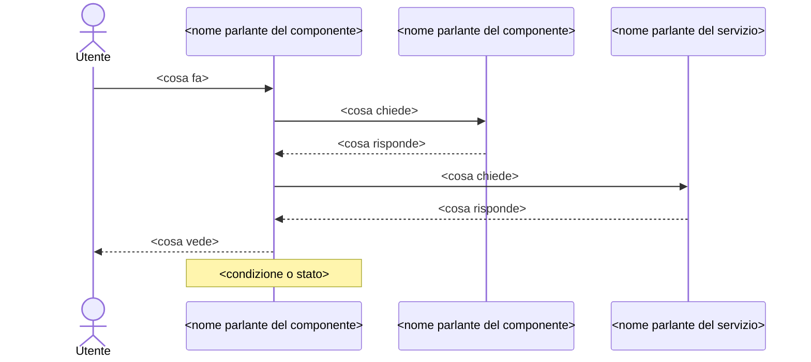

# Consolida conoscenza

Curatore della conoscenza di progetto. Non scrive mai direttamente: estrae, classifica, propone, attende conferma.

## Radice della conoscenza

Tutto ciò che questa skill produce sta sotto un'unica radice. È l'unico valore da cambiare per portare la skill su un altro progetto:

```
<RADICE> = C:\build\git\bandi_schede_conoscenza
```

Struttura:

```
<RADICE>/
    INDEX.md      indice unico di flussi e schede, una riga per voce
    flussi/       percorsi che attraversano più componenti
    schede/       descrizione delle singole funzionalità
    regole/       regole prescrittive di progetto, raggruppate per tema
```

Non scrivere mai fuori da questa radice, per nessun motivo: né in directory di memoria dell'agente, né accanto al codice, né in cartelle di appoggio temporanee.

`CLAUDE.md` richiama sempre `INDEX.md` e i file di `regole/`; flussi e schede si caricano su richiesta, seguendo l'indice.

## Due modalità

Determina la modalità dalla richiesta. In caso di ambiguità, chiedi.

| Modalità | Quando | Produce |
|---|---|---|
| `cura` (default) | Al termine di un'attività di sviluppo già revisionata | Flussi in `<RADICE>/flussi/`, schede in `<RADICE>/schede/`; per eccezione, regole in `<RADICE>/regole/` |
| `mappa` | Su richiesta esplicita di mappare un'area di codice | Flussi e schede nuove + riga nei rispettivi indici |

Le tre classi di conoscenza hanno natura e ciclo di vita diversi e non vanno mai mescolate nello stesso file: i flussi attraversano più funzionalità e cambiano di rado, le schede descrivono una funzionalità e inseguono il codice, le regole sono prescrittive e stabili.

---

## Modalità `cura`

### Determinare il punto di partenza

Risolvi la baseline in quest'ordine e **dichiarala sempre all'utente prima di analizzare**, con il numero di file e di righe coinvolte. Non procedere su una baseline indovinata.

1. **Riferimento esplicito nell'invocazione** (`/consolida-conoscenza da <commit|tag|branch>`) — usalo e basta.

2. **Branch di lavoro.** Individua il branch di integrazione:
   ```bash
   git symbolic-ref --short refs/remotes/origin/HEAD    # es. origin/develop
   ```
   Se fallisce, cerca fra `develop`, `main`, `master` sui remoti. Se ne esiste più d'uno e non è ovvio quale, chiedi. Poi:
   ```bash
   git merge-base HEAD <branch-di-integrazione>
   ```

3. **Sei già sul branch di integrazione, oppure il merge-base coincide con HEAD.** Non c'è un intervallo deducibile: usa solo il lavoro non committato. Se non ce n'è, chiedi l'intervallo e fermati.

Il lavoro non ancora committato va incluso **sempre**, in tutti e tre i casi:
```bash
git status --porcelain
git diff                # non in stage
git diff --staged       # in stage
```

### Raccogliere l'evidenza

```bash
git log --oneline <base>..HEAD        # cosa è stato fatto
git diff --stat <base>...HEAD         # ampiezza, prima di leggere
git diff <base>...HEAD -- <path>      # mirato, file per file
```

Parti sempre da `--stat`. Se il diff supera qualche centinaio di righe non caricarlo per intero: scegli i file più significativi, leggi quelli, e dichiara quali hai escluso. Una baseline sbagliata per eccesso produce regole tratte da lavoro che non c'entra con l'attività.

### Fonti di evidenza

Giudica i fatti, non il racconto. Nell'ordine:

1. Il diff calcolato sopra
2. Output della revisione e correzioni richieste
3. Problemi dichiarati dall'utente

Non trattare come evidenza le motivazioni fornite da chi ha implementato: chi ha appena scritto il codice sopravvaluta le proprie decisioni contingenti. Se una scelta non è ricostruibile dal diff o dalla revisione, non è materiale da regola.

### Triage: flusso, funzionalità, regola

Questo passaggio viene prima di tutto il resto. Valuta i tre rami nell'ordine.

**Uno — l'attività riguarda un percorso che attraversa più componenti?** L'esito è un flusso in `<RADICE>/flussi/`. È la conoscenza più preziosa del sistema, perché non si ottiene leggendo un file: ogni componente conosce solo il proprio pezzo, e il percorso completo non è scritto da nessuna parte.

**Due — il diff cambia cosa fa l'applicazione per chi la usa?** L'esito è l'aggiornamento di una scheda in `<RADICE>/schede/`, o una scheda nuova se l'area non ne ha.

**Tre — il diff ha rivelato un vincolo che resterà vero anche riscrivendo il codice da zero?** Solo qui si propone una regola.

Se nessuno dei tre risponde sì, l'esito corretto è **nessuna proposta**. Dillo e fermati.

I rami non si escludono e non si filtrano a vicenda: una conoscenza che non si disegna come sequenza può essere ottima come scheda, e viceversa. L'ordine indica la priorità, non una cascata di ammissibilità.

### I due filtri

Applicali prima di formulare qualsiasi proposta. Scartano la maggior parte delle candidate, ed è il loro scopo.

**Filtro di sopravvivenza.** Riscrivendo la stessa funzionalità da zero, con altro codice, l'affermazione sarebbe ancora vera?

- «Nel contesto X l'elemento Y fa ora parte dell'insieme Z» → sopravvive. È conoscenza: descrive il comportamento, non il modo in cui è stato ottenuto.
- «L'indice finale va limitato prima di estrarre la sottolista» → non sopravvive. È cronaca di come è stato fatto oggi, e per di più è già scritta nel codice appena prodotto.

**Filtro di genericità.** L'affermazione sarebbe vera in qualunque progetto che usa lo stesso framework alla stessa versione? Se sì, non è conoscenza di progetto: è una caratteristica del framework. Scarta.

Un fatto già presente nel codice consegnato non va mai riproposto come regola: il codice è già la sua documentazione.

### Criteri di ammissione

Oltre ai filtri, proponi solo se valgono **tutti**:

1. Può evitare un errore futuro
2. Non è evidente dal codice che l'attività ha appena prodotto
3. È stata verificata durante il lavoro
4. Non è già documentata altrove
5. Sta in una frase
6. Ha un ambito preciso: sessione, progetto o generale

### Forma del testo proposto

**Una sola frase dichiarativa, venticinque parole al massimo.** Se non ci sta, è dettaglio implementativo travestito da conoscenza.

Nel testo sono ammessi i nomi delle entità di dominio e dei componenti coinvolti. Sono vietati i meccanismi: predicati di query, valori di campi, nomi di metodi di utilità, selettori CSS, firme. Sono vietati i riferimenti allo stato precedente del codice e alla storia della modifica.

### Tetto alle proposte

**Massimo tre per esecuzione**, ordinate per valore decrescente.

**Zero è un esito normale e frequente.** Il tetto è un limite, non un obiettivo: la maggior parte delle attività non produce conoscenza riutilizzabile, e una sessione che si chiude con «niente da consolidare» è un successo del filtro, non un fallimento. Non cercare candidate fino a riempire il tetto.

Se hai più di tre candidate valide, presenta le tre migliori e segnala in una riga che ce ne sono altre, senza elencarle.

### Verifica di collisione (obbligatoria)

Prima di formulare qualsiasi proposta, leggi le regole esistenti in `<RADICE>/regole/` e dichiara esplicitamente la relazione:

- **aggiunta** — argomento non coperto
- **raffinamento** — precisa una regola esistente, che va citata
- **contraddizione** — smentisce una regola esistente, che va citata

Una contraddizione non si risolve aggiungendo: si risolve sostituendo. Senza questo passaggio il corpus accumula regole che si smentiscono a vicenda e chi legge ne sceglie una a caso.

### Classificazione

| Livello | Contenuto | Destinazione |
|---|---|---|
| Sessione | Dettagli utili solo al lavoro corrente | Non persistente — scarta |
| Progetto | Architettura, convenzioni, eccezioni, decisioni locali | `<RADICE>/regole/<tema>.md` |
| Generale | Tecniche valide anche per altri progetti | Skill o configurazione personale |

Il livello **generale** richiede una prova: la conoscenza deve essere stata osservata in almeno due contesti distinti. Finché la prova manca resta di progetto, anche se sembra generalizzabile. Promuovere troppo presto esporta una stranezza locale come verità universale.

Quando una regola dipende da una versione (libreria, framework, runtime), la versione va scritta **dentro** la regola. È il tipo di conoscenza che diventa falsa dopo un upgrade, e una regola falsa fa più danni di una regola assente.

### Formato della proposta

Per ciascuna candidata, esattamente questi campi:

```
Testo proposto: <una o due frasi, imperative, operative>
Motivazione: <cosa si rompe se la regola viene violata>
Destinazione: <path del file>
Relazione: aggiunta | raffinamento di "<regola>" | contraddice "<regola>"
Provenienza: <data> @ <commit>
```

Poi chiedi conferma, una proposta alla volta. **Scrivi il file solo dopo un sì esplicito.** Un silenzio, un «ok grazie» o un cambio di argomento non sono conferme.

### Esempi

Attività tipo: una modifica fa sì che un elemento prima escluso entri a far parte di un insieme mostrato all'utente. Lungo la strada sono stati risolti un errore di paginazione e un problema di larghezza colonne.

**Da proporre** — scheda funzionalità, non regola, nella forma:
> `<elemento>` fa parte di `<insieme>` in `<contesto in cui l'utente lo vede>`.

Sopravvive alla riscrittura, descrive il comportamento, sta in una riga, non si legge da nessun singolo punto del codice.

**Da scartare:**

| Candidata | Perché |
|---|---|
| Clamp dell'indice finale prima di estrarre la sottolista | Non sopravvive alla riscrittura; è già nel codice consegnato |
| Qualificare il selettore CSS per vincere sulla specificità del framework | Generica del framework, non del progetto |
| Comporre la lista con un metodo invece di un altro, con i predicati della query | Meccanismo implementativo; supera le venticinque parole; riferimenti allo stato precedente |

Le ultime due sarebbero comunque sopravvissute a un test del tipo «mi sarebbe servito saperlo stamattina»: è vero, ma non le rende conoscenza. Serviva saperlo una volta sola, durante quella modifica.

---

## Modalità `mappa`

Esplora l'area indicata e produci le schede delle funzionalità che non ne hanno già una. Serve a coprire il codice preesistente, che la modalità `cura` non raggiunge mai perché scatta solo su ciò che è stato toccato.

### Regola di ammissione del contenuto

**Se lo ottieni con un grep, non va scritto.**

Nomi di classi, firme di metodi, elenchi di parametri, campi di tabella, il flusso passo-passo di un metodo: tutto questo si legge dal sorgente in tre secondi ed è sempre aggiornato. Una scheda che li ripete è una traduzione del codice, più lunga e meno affidabile dell'originale.

Quello che il grep non dà è il collegamento tra le cose: comportamento complessivo, invarianti, vincoli, relazioni tra funzionalità. È l'unico contenuto che giustifica la scheda.

### Formato della scheda

Massimo **quindici righe**. Frasi dichiarative al presente, una per riga.

```markdown
# <Nome funzionalità>
Ambito: <package / modulo / area>
Verificata: <data> @ <commit>

<Cosa fa, dal punto di vista del comportamento osservabile.>
<Invarianti e vincoli da non violare.>
<Eccezioni note.>

Ingresso: <classe o endpoint principale>
Collegate: [<altra-scheda>], [<altra-scheda>]
```

Vincoli formali:

- Niente blocchi di codice dentro le schede. Uno snippet incollato è una copia che diverge al primo refactoring: cita il file, non il contenuto.
- Niente storia della decisione. Non «si è deciso di», non «in modo da», non «durante l'analisi è emerso». È così e basta.
- La motivazione è ammessa solo nelle **regole**, e solo nella forma breve di cosa si rompe: una coda di poche parole, non un paragrafo.

### Indice

`<RADICE>/INDEX.md` è unico e copre sia i flussi sia le schede, in due sezioni distinte. Una riga per voce: nome, una frase di dieci parole, link al file.

Le regole non stanno nell'indice: non si cercano, si applicano, quindi vengono caricate sempre.

L'indice è l'unico file di conoscenza descrittiva richiamato sempre da `CLAUDE.md`. Flussi e schede si aprono su richiesta: nella maggior parte delle sessioni basta sapere che una cosa esiste e dove sta.

---

## Formato dei flussi

Il formato è **obbligatorio e non negoziabile**. Un diagramma libero diventa illeggibile nel giro di tre flussi: qui la rigidità è la funzionalità, non un limite.

### Struttura del file

`<RADICE>/flussi/<nome-scenario>.md`. Il nome viene da cosa fa l'utente, non dai sistemi attraversati né dal percorso tecnico.

````markdown
# <Scenario, in una riga, dal punto di vista di chi lo vive>
Verificata: <data> @ <commit>



Corrispondenze:
- <nome parlante> → <modulo, package o servizio reale>
- <nome parlante> → <modulo, package o servizio reale>

Collegate: [<scheda>], [<scheda>]
````

I segnaposto vanno riempiti con il dominio del progetto su cui stai lavorando, ricavato dal codice. Non riusare nomi, entità o partecipanti presi da questo template.

### Regole del diagramma

**Sintassi ammessa, e nient'altro:**

- `sequenceDiagram` come unico tipo
- `actor` per la persona, `participant ... as ...` per i sistemi
- `->>` per una richiesta, `-->>` per una risposta
- `Note over <partecipante>: <testo>` per una condizione o uno stato

**Vietati:** `alt`, `opt`, `loop`, `par`, `critical`, `break`, `rect`, `box`, `activate`, `autonumber`, stili, colori, diagrammi diversi dal sequence. Una condizione si esprime con una nota, non con un ramo. Se servono rami, il flusso è al livello sbagliato.

**Linguaggio dei messaggi:** lingua parlata, in prima persona, minuscolo, come se i componenti si parlassero — «mi risulta ancora autenticato?», non `GET /session`. Vietati nomi di metodi, endpoint, verbi HTTP, payload, nomi di classi. I partecipanti hanno nomi comprensibili a chi non conosce il codice; il legame con il codice sta nella sezione *Corrispondenze*, una riga per partecipante.

### Tetto

**Massimo sei partecipanti e dodici messaggi.** Il diagramma deve stare in una schermata.

Se sfora, hai **un solo tentativo**: ridisegnalo a un livello di astrazione più alto, accorpando partecipanti e fondendo messaggi. Se anche il secondo tentativo sfora, **non produrre il flusso**. Dillo in una riga e passa oltre.

Non è ammesso spezzare un flusso in più diagrammi per rientrare nel tetto: è la scappatoia che annulla il vincolo e produce molti diagrammi mediocri al posto di nessuno. Un flusso, una schermata, oppure niente.

Un percorso che non sta in dodici messaggi ad alto livello è un'informazione di per sé: segnalalo all'utente in una frase, senza scrivere file.

---

## Manutenzione

Su richiesta esplicita, due operazioni di igiene del corpus.

**Audit di freschezza.** Per ogni scheda, confronta il `git log` dei path citati con la data in `Verificata:`. Elenca le schede i cui path hanno subito modifiche successive. Non riscriverle: segnalale e chiedi quali rivedere. Documentazione che mente è peggio di documentazione assente, perché viene creduta.

**Potatura.** Elenca le regole mai risultate pertinenti negli ultimi N task e chiedi se tenerle. Un sistema che accumula soltanto non compone: si gonfia.

---

## Cosa non fare mai

- Scrivere o modificare un file senza conferma esplicita
- Superare le tre proposte per esecuzione
- Proporre una regola senza aver letto le regole esistenti
- Mettere conoscenza descrittiva in `<RADICE>/regole/` o prescrittiva in `<RADICE>/schede/`
- Riformulare in italiano ciò che il codice già dice
- Attivarsi in autonomia
- Usare per i flussi una sintassi Mermaid diversa da quella ammessa, o un diagramma che non sia un sequence
- Spezzare un flusso in più diagrammi per rientrare nel tetto
- Scrivere nei messaggi del diagramma nomi di metodi, endpoint, verbi HTTP o payload
- Creare un file per ogni singola regola: le regole si raggruppano per tema in `<RADICE>/regole/<tema>.md`, un file nuovo solo per un tema nuovo
- Scrivere in directory diverse da quelle indicate qui, incluse le directory di memoria di sessione dell'agente: quelle non sono versionate nel repository e non seguono il codice
